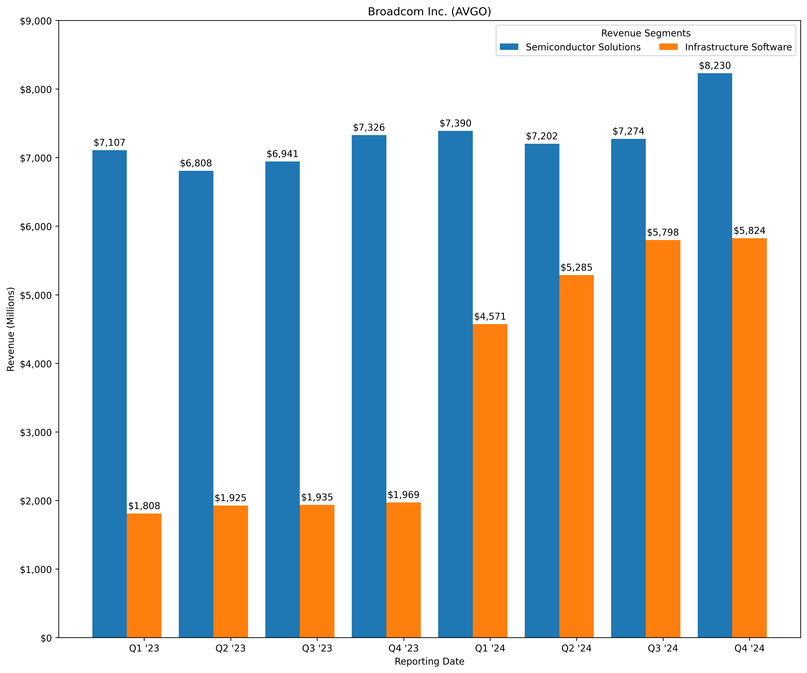
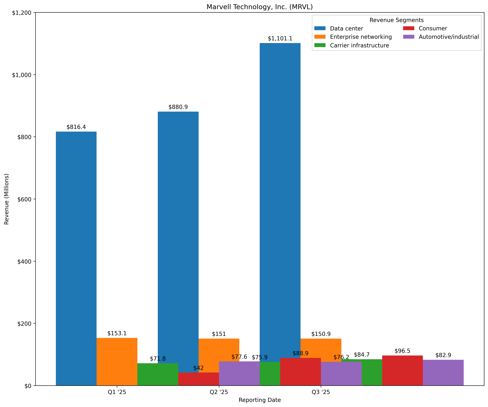
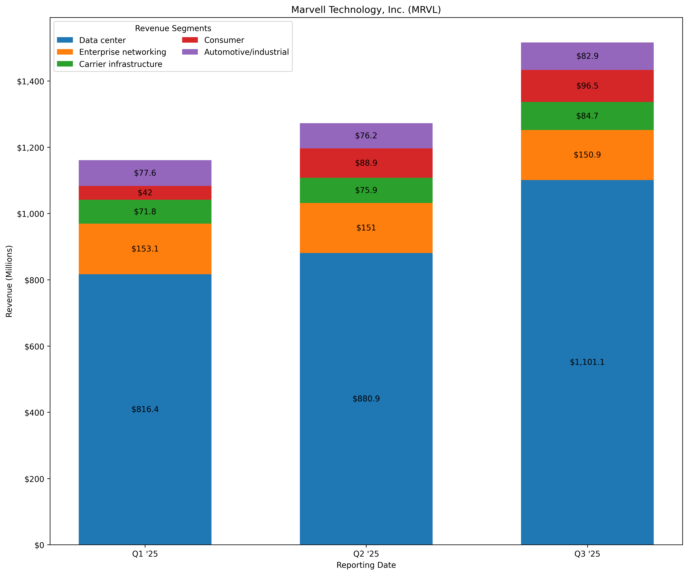

# stock-kpi-plot
Stock KPI analysis tool using matplotlib

## Compatibility

Works with Linux, macOS, and Windows. Requires Python 3.10 or later.

## Usage

### Clone the repo
```
git clone https://github.com/Adobe-Android/stock-kpi-plot.git
```
### Prepare the virtual environment
Install [virtualenv](https://pypi.org/project/virtualenv/) if it is not already installed or use the Python 3.5+ [venv](https://docs.python.org/3/library/venv.html).
```
python -m pipx install virtualenv
```

If you do not have pipx installed, either install it with pip (command below) or first [install pipx](#troubleshooting-install-pipx).
```
python -m pip install --user virtualenv
```

Go to the project directory.
```
cd stock-kpi-plot
```

Next, we can actually create our virtual environment inside of our newly cloned directory.
```
virtualenv env
```

Activate the virtual environment using the appropriate files for our environment. I'll include commands for the most common scenarios below. More information can be found [here](https://virtualenv.pypa.io/en/latest/user_guide.html#activators)

Bash (macOS, Linux, or other Unix)
```bash
source bin/activate
```

PowerShell (Windows)
```
.\env\Scripts\activate.ps1
```

Command Prompt (Windows)
```
.\env\Scripts\activate.bat
```

### Install the necessary packages

```
python -m pip install -r requirements.txt
```

### Run

```
python -m avgo_grouped_barchart_with_labels_from_excel
```

### Example



### Run

```
python -m mrvl_grouped_barchart_with_labels_from_excel
```

### Example



As you can see, this style of bar chart has issues when we try to display more data.
In this case, I chose to switch to a stacked bar chart to resolve this issue.

### Run

```
python -m mrvl_stacked_barchart_with_labels_from_excel
```

### Example



### Additional Notes

The program expects to read from an Excel file in the same directory as the Python script. The expected naming scheme is {ticker}.xlsx.

## Libraries

* [matplotlib](https://matplotlib.org/)

## References
* https://realpython.com/python-virtual-environments-a-primer/

* https://learnpython.com/blog/how-to-use-virtualenv-python/

* https://www.freecodecamp.org/news/how-to-setup-virtual-environments-in-python/

## Troubleshooting (Install pipx)
```
python -m pip install --user -U pipx
python -m pipx ensurepath
```

## Troubleshooting (Windows)
If you are having trouble on Windows specifically, I'd suggest you clean out the following directories. I've found these issues to be common when you've maintained a Windows install long enough to have downloaded at least a few Python versions over time, even if you only have the latest installed now.

```
C:\Users\tngam\.local - delete bin and pipx folders
C:\Users\tngam\AppData\Roaming\Python - delete all folders
```

If you are on macOS or Linux, you probably aren't having these sorts of problems, but feel free to open an issue.
